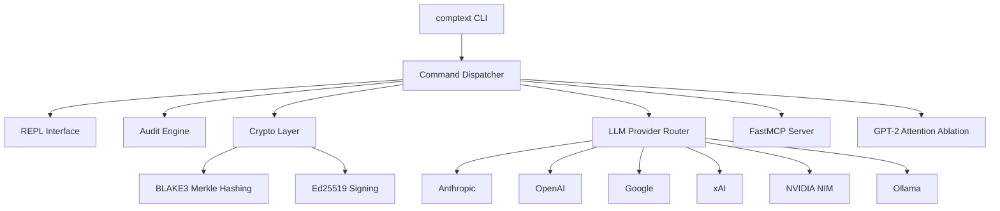
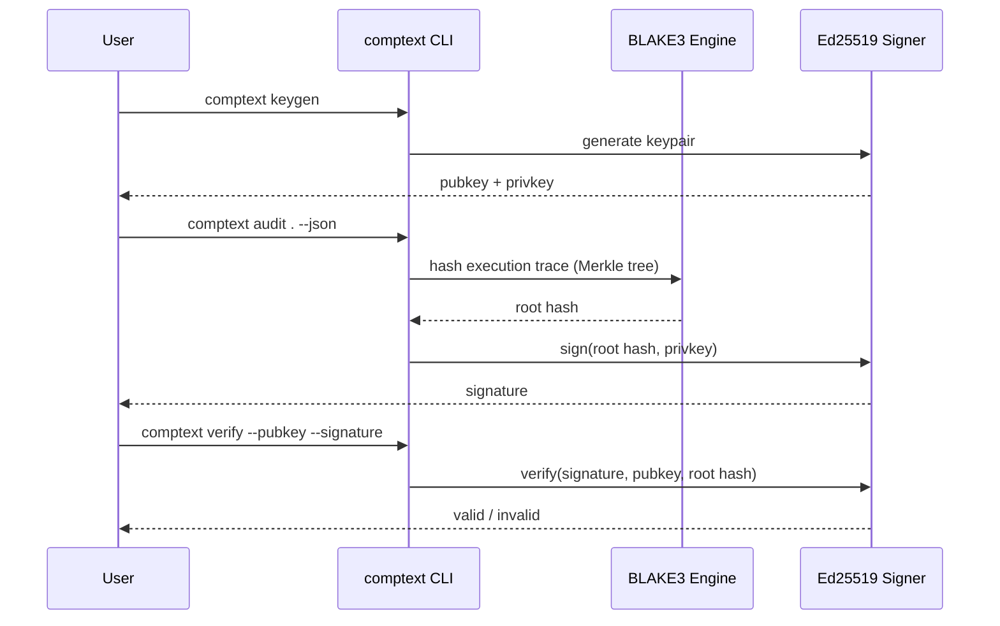

# CompText Core

<p align="center">
  
  
  
  
  
  
</p>

<p align="center">
  
  
  
  
  
  
</p>

**Deterministisches Python CLI mit kryptografischer Verifikation.**

Vereint 6 LLM-Provider (Anthropic, OpenAI, Google, xAI, NVIDIA NIM, Ollama), BLAKE3 Merkle-Hashing, Ed25519-Signaturen,
Attention-Head-Ablation (GPT-2) und einen FastMCP-Server in einem
einheitlichen Tool. Konsolidiert aus 5 fragmentierten Repos zu einem
produktionsnahen v0.1.0-Release.


*Live-Demo: REPL-Start, Audit, Keygen, Capabilities und Help-Befehle*

---

## Architektur



## Projektstruktur

```
comptext-core/
├── comptext/
│   ├── cli/          # audit, verify, logo, code, chat, mcp, keygen
│   ├── core/         # engine, crypto, cognitive, plan_validator,
│   │                 # capabilities, skills
│   ├── mcp/          # FastMCP-Server (9 Tools)
│   ├── providers/    # anthropic, openai, google, xai, nvidia, ollama
│   └── terminal/     # ANSI-Logo-Renderer + chafa-Integration
├── assets/
│   ├── comptext-logo-braille-color.ans
│   ├── demo.gif      # Live-Demo GIF
│   └── demo.tape     # VHS-Aufzeichnungs-Konfiguration (Fallback)
├── tests/            # 57 Tests, 0 Warnungen
├── SKILL.md          # Root-Skill-Definition
├── CHANGELOG.md
└── pyproject.toml
```

## Kryptografischer Verifikationsablauf



## Features

- Deterministisches CLI mit reproduzierbaren Ausgaben
- 6 LLM-Provider-Integrationen in einem einheitlichen Interface
- BLAKE3 Merkle-Hashing für kryptografische Nachweisketten
- Ed25519-Signaturen zur Verifikation von Ausführungsspuren
- GPT-2 Attention-Head-Ablation für Interpretierbarkeitsforschung
- Eingebauter FastMCP-Server für Tool-Integration

## Provider-Vergleich

| Provider    | Streaming | Logprobs | Einsatzzweck                     |
|-------------|-----------|----------|-----------------------------------|
| Anthropic   | ✅        | ❌       | Reasoning, Code-Review            |
| OpenAI      | ✅        | ✅       | Allzweck-Chat, Function Calling   |
| Google      | ✅        | ❌       | Multimodal, lange Kontexte        |
| xAI         | ✅        | ❌       | Echtzeit-Informationen            |
| NVIDIA NIM  | ✅        | ✅       | Kostenlose Modellvielfalt, lokal  |
| Ollama      | ✅        | ❌       | Lokale Modelle (z. B. Llama 3)    |

## Installation

```bash
git clone https://github.com/ProfRandom92/comptext-core.git
cd comptext-core
pip install -e ".[dev]"
```

## Schnellstart

```bash
comptext                    # zeigt das Logo und startet die REPL
comptext audit .             # auditiert das aktuelle Verzeichnis
comptext capabilities --json # zeigt den Capability-Contract
comptext keygen               # erzeugt Ed25519-Schlüsselpaar
comptext --help               # alle verfügbaren Befehle
```

## Provider konfigurieren

```env
ANTHROPIC_API_KEY=sk-ant-...
OPENAI_API_KEY=sk-...
GOOGLE_API_KEY=...
XAI_API_KEY=...
NVIDIA_API_KEY=nvapi-...
```

```bash
comptext chat --provider nvidia
comptext code "erkläre die engine.py" --provider anthropic
```

## Optionale Terminal-Bild-Unterstützung (chafa)

CompText integriert sich mit `chafa` (einem Befehlszeilen-Bild-zu-Terminal-Zeichen-Renderer), um das Rendern benutzerdefinierter Bilder im Terminal zu ermöglichen.

### Installation

`chafa` ist eine System-Binärdatei, kein Python-Paket. Sie kann über den Paketmanager Ihres Systems installiert werden:

- **Windows**: `winget install chafa` oder `scoop install chafa`
- **macOS**: `brew install chafa`
- **Linux**: `sudo apt install chafa` (Debian/Ubuntu) oder `sudo dnf install chafa` (Fedora)

Wenn `chafa` nicht im System-Pfad (`PATH`) installiert ist, stuft das CLI die Ausgabe automatisch und problemlos auf das statische ANSI-Logo oder ein einfaches Texttitel-Fallback zurück.

## Tests

```bash
pytest -v
```

## Beitragen

Pull Requests willkommen. Bitte vor dem Commit pytest -v laufen lassen
und sicherstellen, dass alle Tests grün bleiben.

## Lizenz

Siehe [LICENSE](LICENSE).
