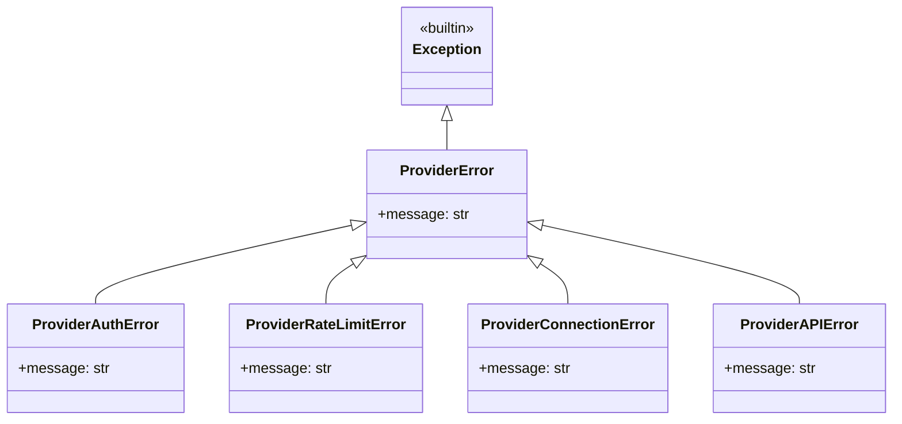

# Data Model: CompText Core Improvements (data-model.md)

This document describes the updated data models for compact Merkle Tree proofs and the provider exception hierarchy.

---

## 1. Merkle Tree Data Structures

### Raw Merkle Proof (Standard JSON Format)
```json
{
  "leaf_hash": "hex_string_64_chars",
  "proof_path": [
    "hex_string_64_chars",
    "hex_string_64_chars",
    ""
  ],
  "root_hash": "hex_string_64_chars"
}
```
*Note: The empty string `""` represents a duplicate sibling (odd-numbered level sibling optimization).*

### Compact Merkle Proof (Token-Optimized Format)
A single compact string using Base64url (no padding) representation of the 32-byte hashes:
```text
<leaf_hash_b64>:<root_hash_b64>:<sibling_1_b64>,<sibling_2_b64>,...
```
- **Example**:
  `fH4i...:gJ9x...:hK8y...,,iL7z...` (with empty segments representing omitted duplicates).

---

## 2. Exception Hierarchy Data Model



### Exception Mappings
- **RateLimitError (OpenAI)** / **HTTP 429** -> `ProviderRateLimitError`
- **AuthenticationError (OpenAI)** / **Missing API Key** -> `ProviderAuthError`
- **APIConnectionError (OpenAI)** / **httpx.ConnectError** / **httpx.Timeout** -> `ProviderConnectionError`
- **APIStatusError (OpenAI)** / **genai.errors.APIError** / **httpx.HTTPStatusError** -> `ProviderAPIError`
